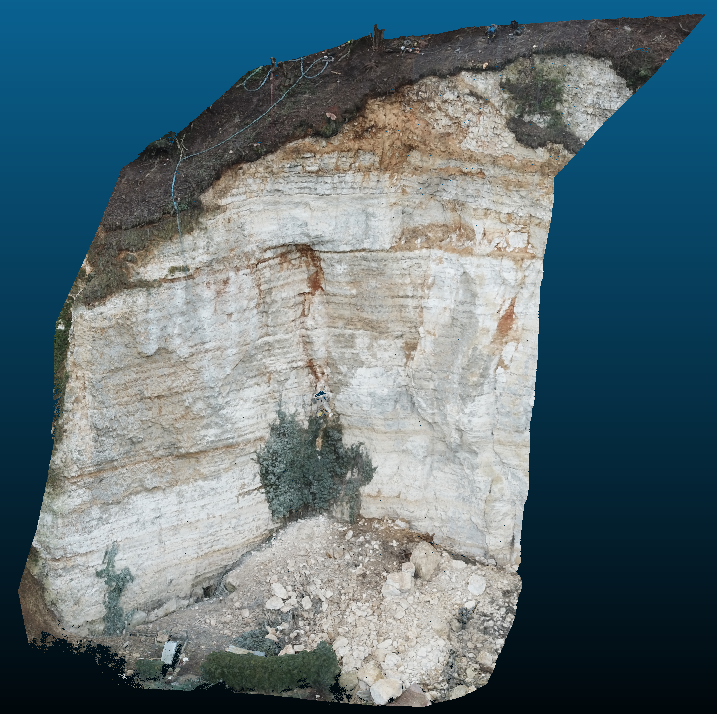

3D point cloud semantic segmentation

<u>FOSS4G-be</u>
 

Bruxelles

2019-10-24
 

Raphaël Delhome &ndash; raphael.delhome@oslandia.com

<!-- .slide: data-background="img/oslbackground.png" data-background-size="500px" -->
<!-- -->

---

## About us

	

		
		
		
 <!-- .element class="fragment" data-fragment-index="1" -->
    

    

	<ul>
	<li>Damien Garaud, Raphaël Delhome</li>
	<li>Programmers & Data Scientists</li>
	<li>Oslandia: SIG, Data, 3D, simulation</li>
 <!-- .element class="fragment" data-fragment-index="1" -->
 
Open Source, Remote, Agile method, Open Data, Machine Learning, PostgreSQL, PostGIS, QGIS, Python, C++, JavaScript, OpenStreetMap, OpenLayers, ...

 <!-- .element class="fragment" data-fragment-index="1" -->
	</ul>
	

---

## Semantic segmentation?

Automatically infer the class of objects in a scene

 <!-- .element class="fragment" -->

---

### In 3D scenes, that's even harder

* One dimension further...

* Labelled dataset scarcity
 <!-- .element class="fragment" -->

* Indoor *vs* Outdoor, urban context *vs* natural context
 <!-- .element class="fragment" -->

---

# The project

<!-- .slide: data-background="img/oslbackground.png" data-background-size="500px" -->
<!-- -->

---

## Project context

Public funding for a joint R&D project (2018)

 <!-- .element class="fragment" -->

 <!-- .element class="fragment" -->

 <!-- .element class="fragment" -->

---

## Geolithe business

* Risk analysis in mountainous environments (crumbling, mudslides, ...)

* Field measurements: 2D (imagery), 3D (photogrammetry), trajectory studies

note: Tancarville, 2.5 millions of points

---

---

## Pas de l'Ours (april 2018)

<video src="./img/pdlo_couleur_bas_1_1.mp4" width="120%" autoplay controls loop/>

note: point identification between photogrammetry captures

---

## Problematic 

Detect material nature to qualify the crumbling risk

	

		<ul>
			<li>scree</li>
			<li>vegetation</li>
			<li>rock</li>
			<li>sand</li>
			<li>...</li>
		</ul>
	

<!-- .element class="fragment" data-fragment-index="1" -->
	

		
	

<!-- .element class="fragment" data-fragment-index="1" -->

---

## Problem solving outline

1. How we **can't** do Deep Learning

2. 3D geometric feature extraction

3. Unsupervised learning

4. Towards (weak) supervision

---

### At the project beginning...

---

### Actually, no

> O. "To run deep learning algorithms, we need plenty of labelled data."
<!-- <\!-- .element class="fragment" -\-> -->

> G. "We have only a few (unlabelled) point clouds. Is that enough?"
<!-- <\!-- .element class="fragment" -\-> -->

> O. "Well, not sure. You can label them?"
<!-- <\!-- .element class="fragment" -\-> -->

> G. "How much does it cost?"
<!-- <\!-- .element class="fragment" -\-> -->

---

### Doing with what we have

* point location: XYZ
* color information: RGB, reflectance, ...

*(...and that's all!)*

---

### By being smart, we can extract more info

Consider local point neighborhoods (PCA! ... Maths!)
  + infer local geometric structures
<!-- .element class="fragment" data-fragment-index="1" -->
  + 2D or 3D projections
<!-- .element class="fragment" data-fragment-index="2" -->
  + neighborhood sizes (10 neighbors? 100? 1000?)
<!-- .element class="fragment" data-fragment-index="2" -->

https://scikit-learn.org/stable/modules/generated/sklearn.decomposition.PCA.html

note: on connait le PCA comme étant une technique de réduction de
dimension. Ici on a que 3 *features*, les coordonnées. On va se servir de
l'aspect information de variance pour extraire une info géométrique.

---

### Unsupervised learning

Exploit all these features in k-means clustering: classify points with respect
to their geometric properties

---

Yeah, it works! (almost)
<video src="./img/pombourg-kmean.mp4" width="80%" autoplay controls loop/>

---

(**spoiler:** sometimes, it fails...)

<video src="./img/malaussene-kmean-3-labels.mp4" width="80%" autoplay controls loop/>

note: feature engineering, post-processing and interpretation difficulties

---

### Extract local point cloud samples

One can "cut" local samples of known class:

<video src="./img/pombourg-samples.mp4" width="60%" autoplay controls loop/>

note: thanks to Geolithe's works, we extracted some label samples in order to have a better understanding of geometric features

---

### Geometric feature advanced study

* Elementary statistics on each features
* Feature ~ neighborhood size * label sample

---

### Supervised learning

**Logistic Regression!!**

1. Consider a sample for each label
<!-- .element class="fragment" -->
2. Extract the whole set of geometric features
<!-- .element class="fragment" -->
3. Concatenate all the sample features
<!-- .element class="fragment" -->
4. Here comes the labelled dataset (+50k points)
<!-- .element class="fragment" -->

---

### A few more results

	

		<ul>	
			<li>>99% accuracy even after cross-validation</li>
			<li>However, overfitting!</li>
			<li>Multi-colinearity</li>
			<li>Training data representativeness</li>
		</ul>
	

	

		<video src="./img/pombourg-classif-regression-log.mp4" autoplay controls loop/>
	

---

### What if we do not have any labels?

**Weak Supervision!!**

* Label the point cloud massively, automatically, by exploiting expert knowledge

<!-- .element class="fragment" data-fragment-index="1" -->

* Snorkel: https://www.snorkel.org/ (Stanford)

---

### A on-going work...

<video src="./img/pombourg-weak-supervision.mp4" width="80%" autoplay controls loop/>

---

> O. "Finally we did some deep learning stuffs... :)"

---

## Conclusions

* We developed 3D skills, (re)discovered hard maths, and did a lot of parallel
  programming! :)

* A bunch of really promising results

* Test of a new exciting machine learning technique: *weak supervision*

---

## Thanks for your attention!

Questions?

<a href="mailto:damien.garaud@oslandia.com">damien.garaud@oslandia.com</a>
<a href="mailto:raphael.delhome@oslandia.com">raphael.delhome@oslandia.com</a>
<!-- .slide: data-background="img/oslbackground.png" data-background-size="650px" -->
<!-- -->

See more on <a href="http://oslandia.com/en/blog/">Oslandia's blog</a> and on <a href="https://github.com/Oslandia/geo3dfeatures">github.com/Oslandia/geo3dfeatures</a> (released soon)

---

### References

- Nicolas Brodu, Dimitri Lague, 2011. [3D Terrestrial lidar data classification of complex natural scenes using a multi-scale dimensionality criterion: applications in geomorphology](https://arxiv.org/abs/1107.0550). arXiv:1107.0550.

- Martin Weinmann, Boris Jutzi, Stefan Hinz, Clément Mallet, 2015. [Semantic point cloud interpretation based on optimal neighborhoods, relevant features and efficient classifiers](http://recherche.ign.fr/labos/matis/pdf/articles_revues/2015/isprs_wjhm_15.pdf). ISPRS Journal of Photogrammetry and Remote Sensing, vol 105, pp 286-304.
