<center>
<p>
  <b style="font-size: 1.5em">Geospatial data processing for image automatic analysis</b>
</p>
  </br>
  <div style="font-size: 0.9em">FOSS4G2019 - Bucharest</div>
  </br>
  <em style="font-size: 0.7em">Raphaël Delhome</em>
  </div>
  <br>
  
</center>

<!-- .slide: data-background="img/oslbackground.png" data-background-size="650px" -->
<!-- -->

---

## Introduction
<!-- .slide: data-background="img/oslbackground.png" data-background-size="650px" -->
<!-- -->

---

## Oslandia and I

<div id="left">
	
</div>

<div id="right">
	<ul>
		<li>Data/R&D engineer at Oslandia for 2 years</li>
		<li>Working on geospatial data solutions</li>
		<li>Design data pipelines and AI-related algorithms</li>
	</ul>
</div>

---

## Context

<ul>
<li>Artificial Intelligence at Oslandia</li>
<li>Aerial image democratization</li>
<li><emph>A historic use case: building footprint detection</emph></li>
<!-- .element: class="fragment" data-fragment-index="1" -->
</ul>

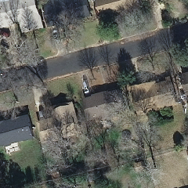
<!-- .element: class="fragment" data-fragment-index="1" -->
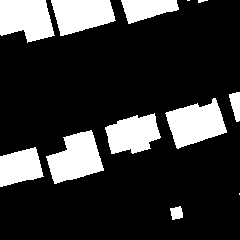
<!-- .element: class="fragment" data-fragment-index="1" -->

---

## Deep learning and geospatial data
<!-- .slide: data-background="img/oslbackground.png" data-background-size="650px" -->
<!-- -->

---

## Image analysis use cases at Oslandia

Tech stack: Linux, Python (Keras, Pillow, ...)

<div id="left">
	*Semantic segmentation*
	<ul>
		<li>Street-scene images</li>
		<li>Aerial images</li>
		<li>OpenStreetMap data parsing</li>
	</ul>	
<a href="https://github.com/Oslandia/deeposlandia">(github.com/Oslandia/deeposlandia)</a>
</div>
<!-- .element: class="fragment" data-fragment-index="1" -->

<div id="right">
	*Instance segmentation*
	<ul>
		<li>Aerial images</li>
	</ul>
</div>
<!-- .element: class="fragment" data-fragment-index="2" -->

---

## Deep learning methods

<ul>
<li>Image (RGB, 8/16-bandwidth) instead of 3D geometries</li>
<li>Semantic segmentation (object classes)
<!-- .element: class="fragment" data-fragment-index="1" -->
<li>Instance segmentation (individual objects)</li>
<!-- .element: class="fragment" data-fragment-index="2" -->
</ul>

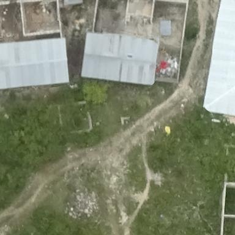
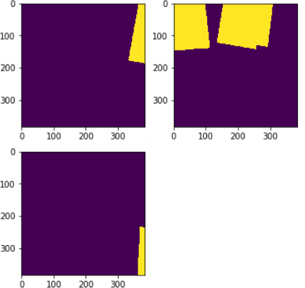
<!-- .element: class="fragment" data-fragment-index="1" -->
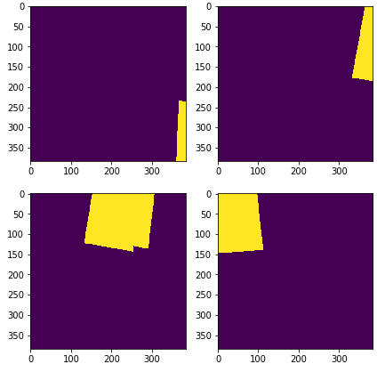
<!-- .element: class="fragment" data-fragment-index="2" -->

---

## Tanzania dataset

<ul>
<li>Released during last FOSS4G conference (see [Challenge](https://competitions.codalab.org/competitions/20100)), buildings in Tanzania </li>
<li>Building instance detection and status discrimination (completed, unfinished, foundation)</li>
<li>13 images (from 17k x 42k to 51k x 51k pixels)</li>
</ul>

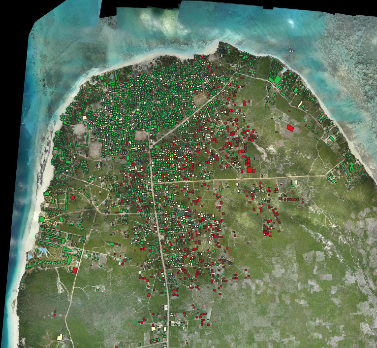

---

## AerialImage (INRIA)

<ul>
<li>Georeferenced *.tiff* images (5000 * 5000 pixels)</li>
<li>360 images (10 cities of 36 tiles each)</li>
<li>50% training, 50% testing</li>
</ul>

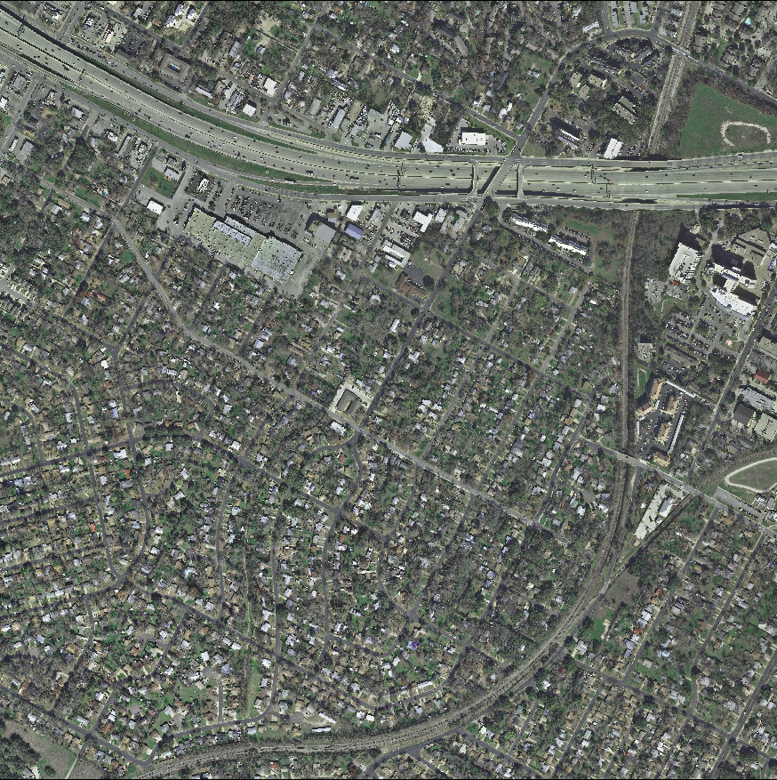
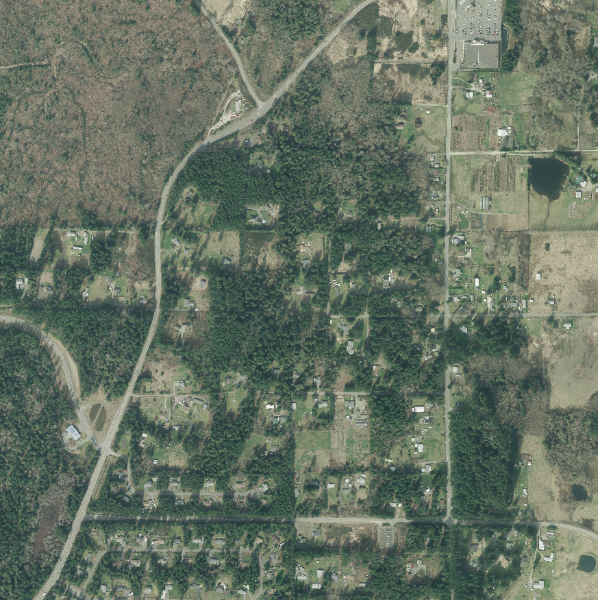

---

## Link with OSM data

<ul>
<li>Rebuild labelled images starting from OSM database</li>
<li>OSM data as Ground-truth *OR* additional input data</li>
<li>Process:
<ul>
<li>Extract coordinates (GDAL)</li>
<li>Query OSM data (Overpass)</li>
<li>Store the data (osm2pgsql)</li>
<li>Generate raster tile (Mapnik)</li>
</ul>
</li>
<!-- .element: class="fragment" data-fragment-index="1" -->
</ul>

<a href="https://github.com/Oslandia/osm-deep-labels">(github.com/Oslandia/osm-deep-labels)</a>
<!-- .element: class="fragment" data-fragment-index="2" -->

---

## Link with OSM data

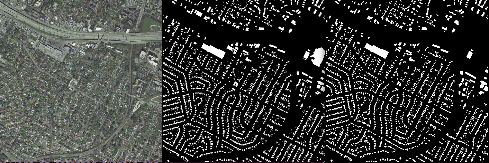

<!-- (left) Raw image; (center) Ground-truth labels; (right) OSM raster -->
<ul>
<li>Left : raw image</li>
<li>Center : ground-truth label</li>
<li>Right : OSM raster</li>
</ul>

---

## Steps of a deep learning project
<!-- .slide: data-background="img/oslbackground.png" data-background-size="650px" -->
<!-- -->

---

## Data parsing

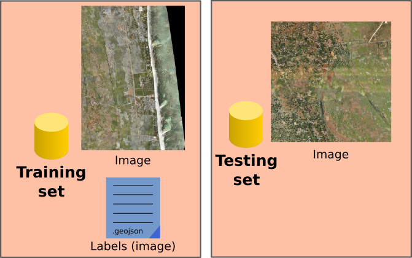

---

## Data preprocessing

Transform raw images into exploitable tiles:
- `GDAL`
```sh
gdal_translate -srcwin <min-x> <min-y> <tile-width> <tile-height>
	<input-path> <output-path>
```
- `numpy`
```python
tile_data = image_data[
	x:(x + tile_size), y:(y + tile_size)
]
```

---

## Model training

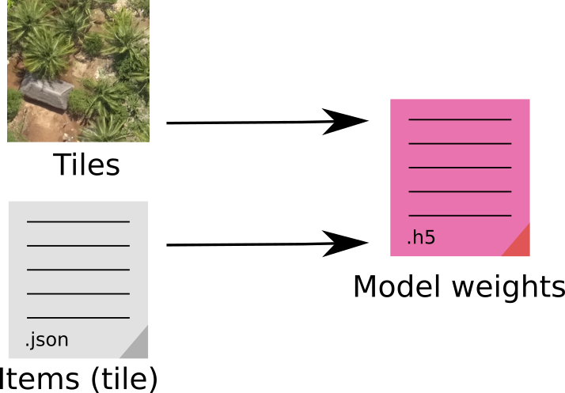

---

## Model training

Deep learning main challenge:
- Hyperparameter settings: number of training epochs? Learning rate?
<!-- .element: class="fragment" data-fragment-index="0" -->
- Hardware criticity: 1 GTX 1070Ti GPU
<!-- .element: class="fragment" data-fragment-index="1" -->

---

## Model inference

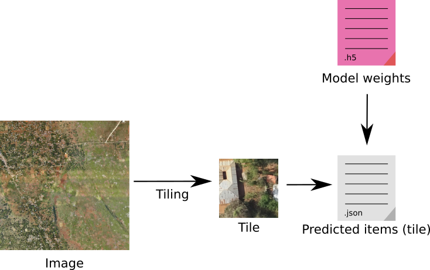

---

## Model inference

- Generate tiles on test images (*cf* preprocessing)
- Use `keras` API:

```py
net = SemanticSegmentationNetwork()  # Create the architecture
model = Model(net.X, net.Y)  # Instanciate the NN model
model.load_weights(<weights_path>)  # Load trained weights
y_raw_pred = model.predict(<images>)  # Predict class scores
predicted_labels = np.argmax(y_raw_preds, axis=3)  # Get pixel classes
```

*Output: tables of class IDs for each input image*
<!-- .element: class="fragment" data-fragment-index="3" -->

---

## Postprocessing

- Post-process detection output and produce georeferenced objects
  + Detect polygon contours within boolean masks: OpenCV 
<!-- .element: class="fragment" data-fragment-index="1" -->
  + Transform pixels into geographical coordinates
<!-- .element: class="fragment" data-fragment-index="2" -->
  + Build polygons with geojson and shapely
<!-- .element: class="fragment" data-fragment-index="3" -->
```py
geom = geojson.Polygon(<list-of-points>)
polygon = shapely.geometry.shape(geom)
```
<!-- .element: class="fragment" data-fragment-index="3" -->

---

## Result visualization

<div id="left">
	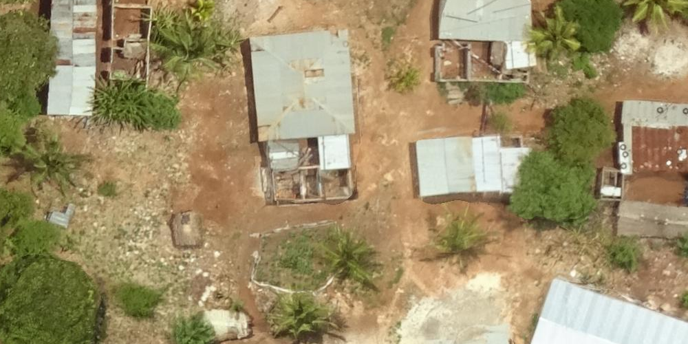
	<ul>
	<li>Predict labels on a bigger image</li>
	<li>Transform them as geometries</li>
	</ul>
</div>

<div id="right">
	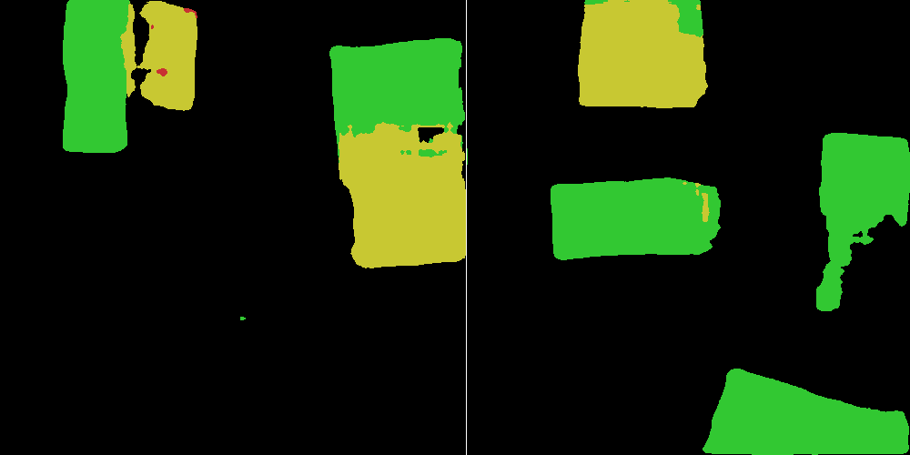
	
</div>

---

## Conclusion and perspectives
<!-- .slide: data-background="img/oslbackground.png" data-background-size="650px" -->
<!-- -->

---

## Conclusion and perspectives

<ul>
	<li>Geospatial data pipeline Proof of Concept: `preprocessing` -> `training` -> `inference` -> `postprocessing`</li> <a href="https://github.com/Oslandia/tanzania-challenge">github.com/Oslandia/tanzania-challenge</a>
	<li>Modest results for now... Need for spending time on:
	<ul>
	<li>data preprocessing</li>
	<li>model training!</li>
	</ul></li>
	<!-- .element: class="fragment" data-fragment-index="1" -->
	<li>Towards a QGIS plugin!</li>
	<!-- .element: class="fragment" data-fragment-index="2" -->
</ul>

---

## Bonus track: web app demo

<a href="http://data.oslandia.io/deeposlandia">
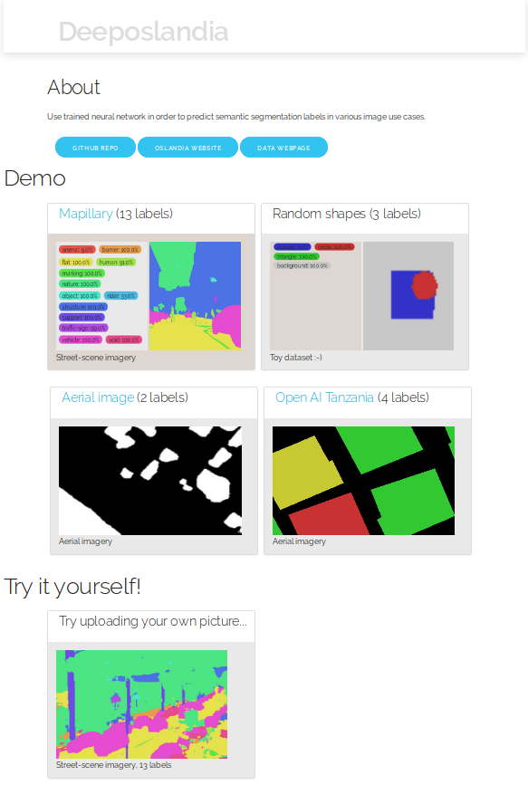
</a>

---

## Thank you for your attention!

<!-- .slide: data-background="img/oslbackground.png" data-background-size="650px" -->
<!-- -->

Find out more:
<ul>
<li><a href="https://oslandia.com/en/2018/11/12/how-to-implement-a-deep-learning-data-pipeline/">https://oslandia.com/en/blog/</a></li>
<li><a href="https://github.com/Oslandia/deeposlandia">github.com/Oslandia/deeposlandia</a></li>
<li><a href="https://github.com/Oslandia/osm-deep-labels">github.com/Oslandia/osm-deep-labels</a></li>
<li><a href="https://github.com/Oslandia/tanzania-challenge">github.com/Oslandia/tanzania-challenge</a></li>
<li><a href="http://data.oslandia.io/">http://data.oslandia.io</a></li>
</ul>
