<!-- Open source contributors do more than they should. QGIS as a reference project should find sustainable ways to rock!

QGIS - like Geoserver, Mapserver and all the great OSGEO project - do not have to prove any longer that they can do the job. We now have millions of users, with great expectations, growing budgets and growing communities. Still we lack funding for boring tasks : packaging, bugfixing, documentation, QA and marketing need some love.

What about changing minds and stop saying open source does not cost anything ? Could that solve this situation where countries having most users also have the less contributors ? This talk will take profit of real life examples of big corporations that decided to pivot their approach from "using open source" to "embrace Opensource".

Let's get out of our technical comfort zone and expose ourselves to enlarge our contributor's base.

This is a deeply optimistic talk looking right into the eyes of what we need to improve, as an opensource ecosystem !

todo : 

questions 


https://docs.google.com/presentation/d/15fBntItxpOk3V8ZVmg0g6Ox5-ZylInN2zVpVBSrKi6k/edit#slide=id.p -->


### Do open source contributors do more than they should ?


_QGIS as a reference project to find sustainable ways to rock!
_
<!-- .slide: data-background="oslbackground.png" data-background-size="850px" -->

---

## /me

```
Régis Haubourg

French guy passionate with geospatial stuff
Open Source changed  my life - litteraly

Former GIS data admin (water basin agency)  - SQL saved my life
Former agronomic engineer           - GIS turned into a passion


Open Source expert at Oslandia                QGIS & PostGIS fan
OSGEO French local chapter president    ...slowly becoming a nerd 

```

---

## OSLANDIA

French company started in 2009

Open source and geospatial only

GIS - 3D - DATA/AI

---

## OSLANDIA

15 collaborators 

**100% remote working**

**100% open source**

**horizontal and transparent governance**

some QGIS and postGIS core commiters.. 

---

## Open Source communities

QGIS 

PostGIS

iTowns (3D web framework)

python, SQL, C++, javascript, data science


---


---


A reference Free software community project in the world


---


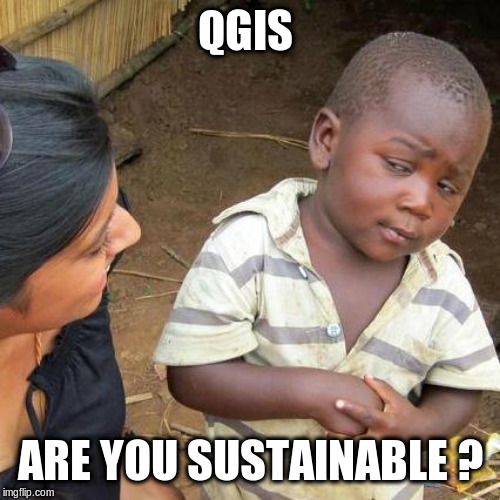

---

### No more a young children

<!-- 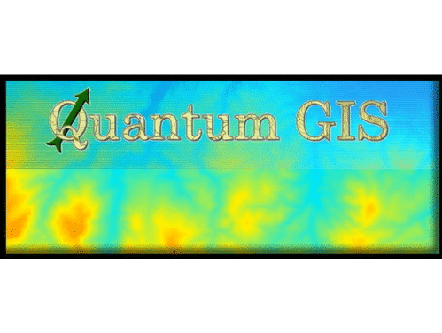 -->

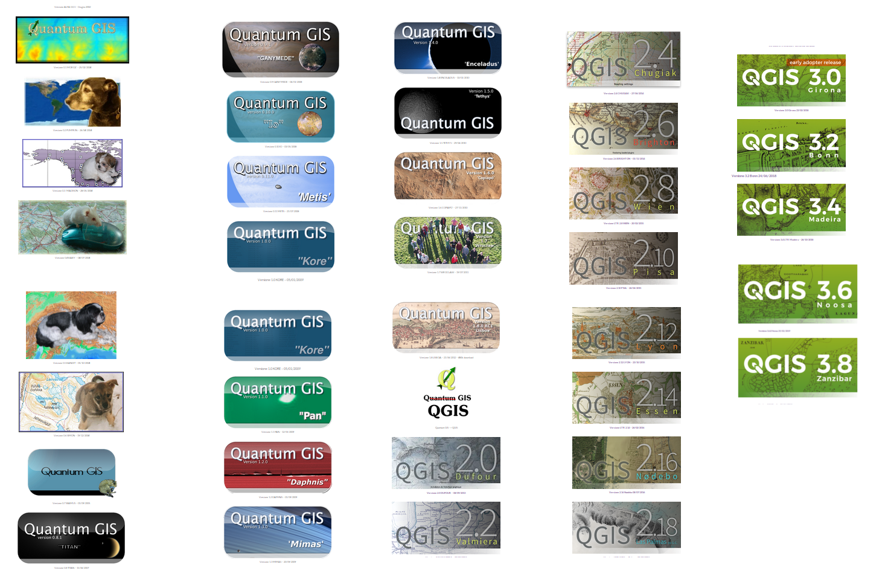

---


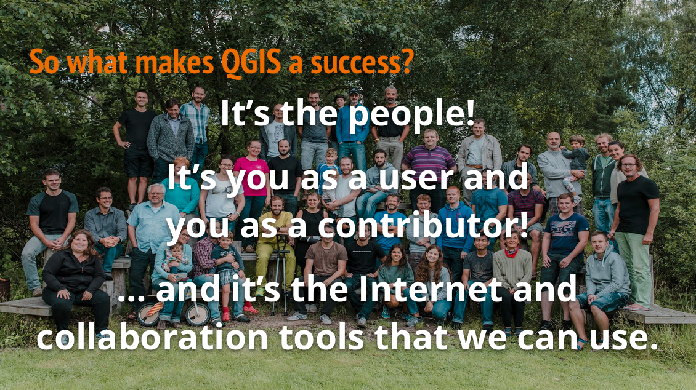

---

## What is a happy contributor ?

Eat

Have a social life

Pay the rent

Raise kids 

Buy a neat new 64 Go RAM to compile QGIS faster ;-)

..

Get stickers

---


# Do not burnout


---


### History of QGIS contribution

20020 - Gary Sherman releases 0.0.1

Paid services very early. Most started being paid between 1.6 (2010) and 2.0 (2014)

Currently a whole commercial ecosystem exists in most countries. 

https://www.qgis.org/en/site/forusers/commercial_support.html

---

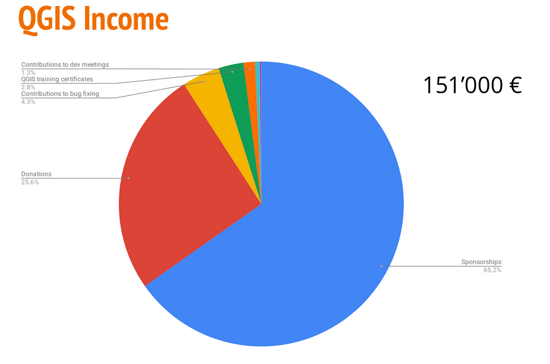

Funds for QGIS.org

---

but that's only a fraction of it 

### 26 Million dollars !!

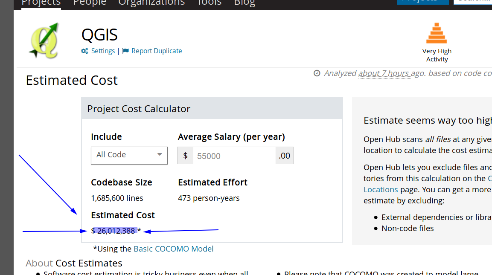

let's say 20% of it was funded, 
5.6 Million dollars might reflect the real transactions 

(totally random estimate) 

---

## Sponsors (2019)

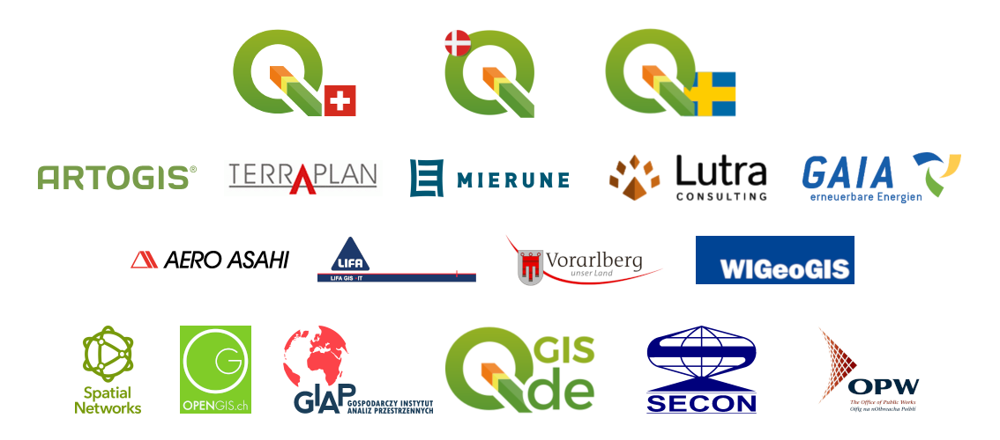


---


### Expenses of QGIS.org budget (2018)

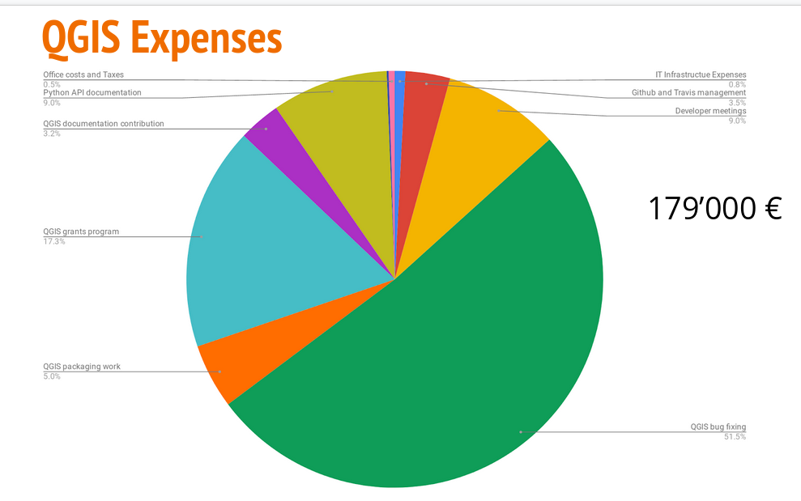


---

# Underfunded tasks ?

---


* Infrastructure

-

* Packaging

-

* Documentation


---

#### Underfunded tasks


* Communication Marketing
  * blog / maintain welcome page feed
  * explain (versions, LTR vs release, roadmap)

* Bug triage

* Quality Assessment (real testing during freeze periods)

* Code review


---

### French self bashing

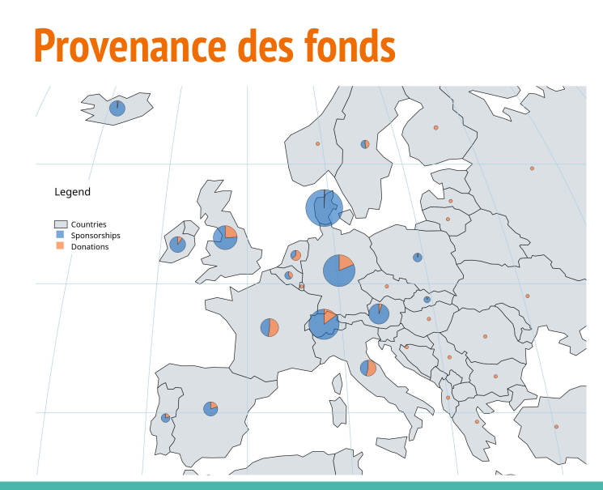

---


# New trends !

_(in France at least)_


---

### 

CellPhone, optic Fiber, traditional communication, Internet Provider

Embrassing open source totally - Top Bottom ! 

Long history with OW2 cluster. 

Support contract with Oslandia shown as a model

---

Allowed:

- QGIS server refactor

- QGIS server OGC certification

- QGIS server perfs improvements

- Security audit and hardening


---

### Big cities

Lyon Métropole - migration to postgreSQL & QGIS & support contracts

Grenoble Métropole  - migration to postgreSQL & QGIS & support contracts

---


### Water companies


Worlwide water distribution

Challenging its internal habits with Inner Source 

Prototyping QGIS for desktop apps and QGIS server on the cloud for web mapping

---

### Public research 

Open source generation is taking the power

cooperation

centralized data and databases

wonderful mix of open data, open hardware and open source

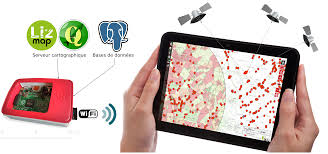

---

# You ?

---

### How many use QGIS? 


---

### How many know the actual roadmap of QGIS? 

(fixed schedule / 4 months releases / 1 month minor versions / 1 year LTR)

---

### How many test QGIS and report issues and feedback during freeze period? 

On your own real production use cases. 

---

### How many of you have been blocked by an unfixed bug


---

### How many have support contracts ? 

---

### How many have subsribed to a user group ?

---

### How many have tried to subscribe or sponsor QGIS.org? 

Sponsoring OSGEO chapter or local user group is a valid YES

---


### How many of you start courses explaining the economics of our contributive model ? 


---

### How many of you took a fraction of the proprietary support contracts amount into open source contribution 

(how many of you struggle to get back budgets, where buying licence is easier?)


---

# How to improve this? 

---

### Sponsoring & donations

Funding meetings, bug fix sprints, grant applications, infrastructure

Spread the word, act in local chapters. Convince your boss. And the boss above him. 

---

### Local chapter / local QGIS user group

---

Create one

Get money from subscriptions and events

---

Use a part of it for 

**sponsoring**

**grant application**

**Raise new contributors**


---

Make it fun !

---

Raise baby contributors 


---

### Certification programs

* Certificate trainees 
  * fund QGIS.org (already 10k € and >500 certicate issues)
  * explain contributive model to trainees
  * get more contribution from training providers  
  
  http://changelog.qgis.org/en/qgis/certifyingorganisation/list/

---

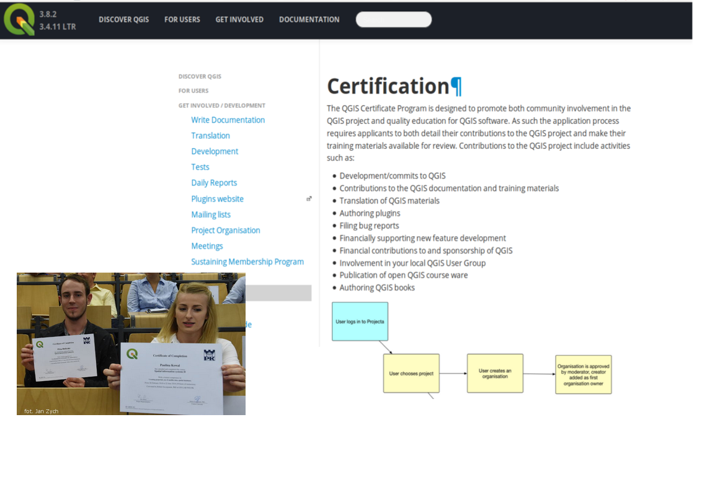

---

# Support contracts 

---
* Time to: 

  * Time to understand issues

  * Time to prepare new features ideas

  * Time to help in deploying / configuring

* Fast

* Give credit,security and insurance to IT departement / Decision makers

---

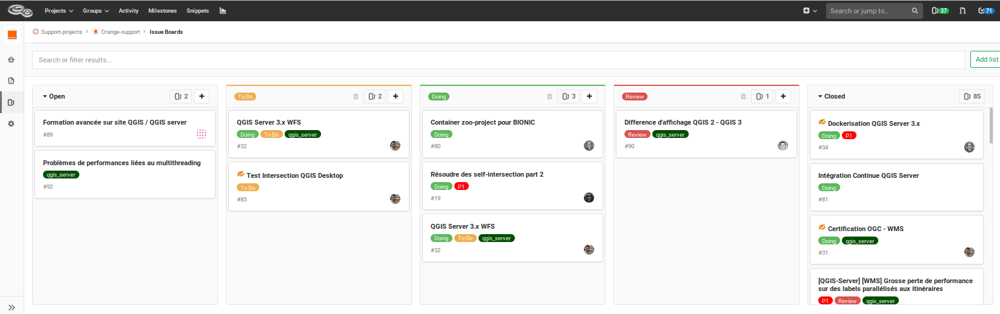


---

# Homework duty 

---


Energy can't be only on dev's side. 

Fight to find budgets.

Fight to resist bureaucratic rules

Out of your comfort zone?     Dare, try. 

---


Most people are true supporters but 

most think there is a big corp underneath 

**Advertise the OSGEO model. **

Make it serious and credible

**IT. WORKS.**

**DO IT :)**


---


_Congratulations, you probably became a very efficient contributor at this stage!_


---

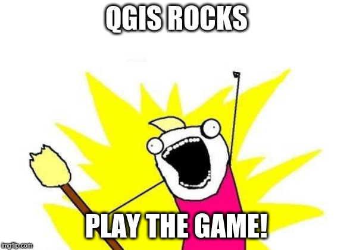

---


### Any questions ?  

Slides and sources available at : 

https://github.com/Oslandia/presentations//2019/foss4g/qgis_and_sustainable_foss_r_haubourg/slide.md

<!-- .slide: data-background="oslbackground.png" data-background-size="650px" -->

