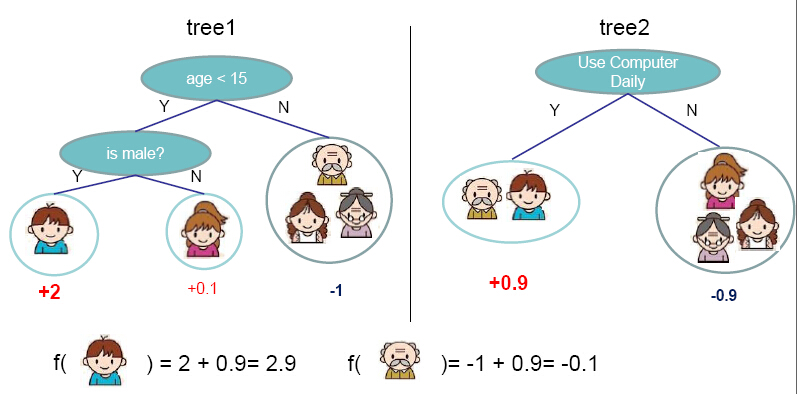

  <b style="font-size: 1.5em">Shared-bike services: from open data platforms to a dataviz application</b>

   
  
FOSS4G2019 - Bucharest

   
  <em style="font-size: 0.7em">Raphaël Delhome(*), Damien Garaud</em>
  

   
  

<!-- .slide: data-background="img/oslbackground.png" data-background-size="650px" -->
<!-- -->

---

## Introduction
<!-- .slide: data-background="img/oslbackground.png" data-background-size="650px" -->
<!-- -->

---

### Shared-bike services

  
  <a href="https://velov.grandlyon.com/">Velo'v (Lyon)</a>

<!-- .element: class="fragment" data-fragment-index="1" -->

  + Shared-bike rental service in large cities
  + Small-duration rents
  + Stations and availability

<!-- .element: class="fragment" data-fragment-index="0" -->

---

### Major challenges

+ Bike (resp. bike stand) availability ?
+ Bike-sharing station classification ?
+ Data pipeline design ?
<!-- .element: class="fragment" data-fragment-index="1" -->

<!-- .element: class="fragment" data-fragment-index="1" -->

---

## Outline

<em>(Part 1)</em> Handle open geospatial data

<em>(Part 2)</em> Bike-sharing station unsupervised classification

<em>(Part 3)</em> Bike and station short-term availability prediction

<em>(Part 4)</em> Web application demo

---

## Data overview
<!-- .slide: data-background="img/oslbackground.png" data-background-size="650px" -->
<!-- -->

---

### Open geospatial data

+ <a href="https://data.grandlyon.com/">Lyon, France</a>

+ <a href="http://opendata.bordeaux.fr/">Bordeaux, France</a>
<!-- .element: class="fragment" data-fragment-index="1" -->

<!-- .element: class="fragment" data-fragment-index="1" -->

---

### Which data?

id | bs | abs | ab | status | last_timestamp
---|---|---|---|---|---|---
10063 | 34 | 10 | 23 | OPEN | 2017-07-08 23:49:09
10021 | 19 | 0 | 0 | CLOSED | 2017-07-08 00:30:12
8038 | 20 | 6 | 14 | OPEN | 2017-07-08 23:49:26
7045 | 20 | 13 | 7 | OPEN | 2017-07-08 23:52:43

---

### General Bikeshare Feed Specification

https://github.com/NABSA/gbfs

<!-- .element: class="fragment" data-fragment-index="1" -->

---

### Data pipeline

+ Build a Python data pipeline thanks to <a href="https://luigi.readthedocs.io/en/stable/">Luigi</a>
+ Get, transform and store the data
  - get data every five minutes (`json`, `shp`)
  - in-base storage (`PostgreSQL`+`Postgis`)
  - feature engineering and ML treatments

---

## Bike-sharing station classification
<!-- .slide: data-background="img/oslbackground.png" data-background-size="650px" -->
<!-- -->

---

### Objective

+ Classify bike-sharing station according to their usage by customers

+ <em>Main idea =</em> group stations that look similar
<!-- .element: class="fragment" data-fragment-index="1" -->

+ ... <em>What does it mean?</em> => Focus on the time series
<!-- .element: class="fragment" data-fragment-index="2" -->

<!-- .element: class="fragment" data-fragment-index="2" -->

---

### K-means clustering

<ul>
<li> Inspired from <a href="https://towardsdatascience.com/usage-patterns-of-dublin-bikes-stations-484bdd9c5b9e">a similar work of James Lawlor</a>
 </li>
<li> One profile = one individual </li>
<li> Group similar individuals together </li>
<li> Deduce stations profiles </li> </ul> 

  
  *ex:* 4 clusters in Lyon

<!-- .element: class="fragment" data-fragment-index="1" -->

---

### Clustered station mapping

---

## Shared-bike availability prediction
<!-- .slide: data-background="img/oslbackground.png" data-background-size="650px" -->
<!-- -->

---

### Objective

+ Know if some bikes (<em>resp.</em> stations) will be available in the next few minutes

+ <em>Main idea =</em> Predict **future** availability with availability **history**
<!-- .element: class="fragment" data-fragment-index="1" -->

+ ... <em>What does it mean?</em> => Supervised learning to learn an availability probability
<!-- .element: class="fragment" data-fragment-index="2" -->

---

### XGBoost method

  Use a boosting tree method :
  <ul>
  <li>to predict <b>Y</b> (availability probability at H+1)</li>
  <li>starting from <b>X</b> (hour, day, available bikes at H, ...)</li>
  </ul>

<!-- .element: class="fragment" data-fragment-index="1" -->

  

<!-- .element: class="fragment" data-fragment-index="2" -->

---

### Results

  Without tuning features, RMSE = 0.095

  
   (^) Error 

<!-- .element: class="fragment" data-fragment-index="1" -->

 
  
  
 (^) Prediction; Ground-truth (v)
  

---

## Demo
<!-- .slide: data-background="img/oslbackground.png" data-background-size="650px" -->
<!-- -->

Web application: <a href="http://data.oslandia.io/bikes/">http://data.oslandia.io/bikes/</a>

---

## Conclusion
<!-- .slide: data-background="img/oslbackground.png" data-background-size="650px" -->
<!-- -->

---

### Conclusion and perspectives

+ Addressing some simple research questions with some open geospatial dataset
+ From data source to database (ETL-like) with <a href="https://luigi.readthedocs.io/en/stable/">Luigi</a>
+ Production of an API to visualize data => towards production?
+ Online learning: keep on gathering data, and learn continuously

---

## Thanks for your attention!

Questions?

<a href="mailto:damien.garaud@oslandia.com">damien.garaud@oslandia.com</a>
<a href="mailto:raphael.delhome@oslandia.com">raphael.delhome@oslandia.com</a>
<!-- .slide: data-background="img/oslbackground.png" data-background-size="650px" -->
<!-- -->

See more on <a href="http://oslandia.com/en/blog/">Oslandia's blog</a> and on <a href="https://github.com/garaud/jitenshea">github.com/garaud/jitenshea</a>
