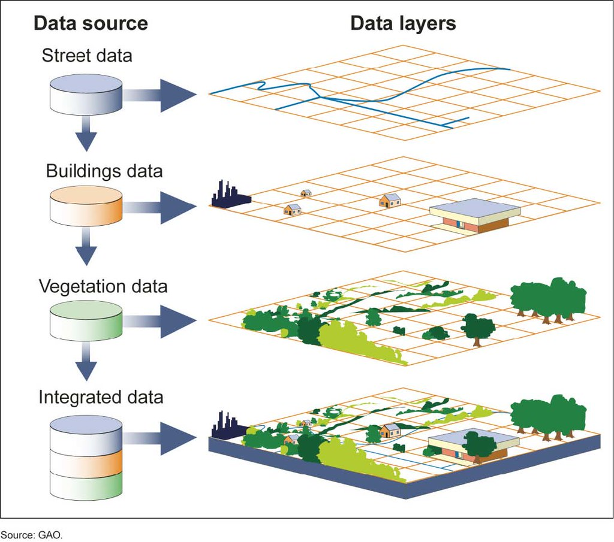
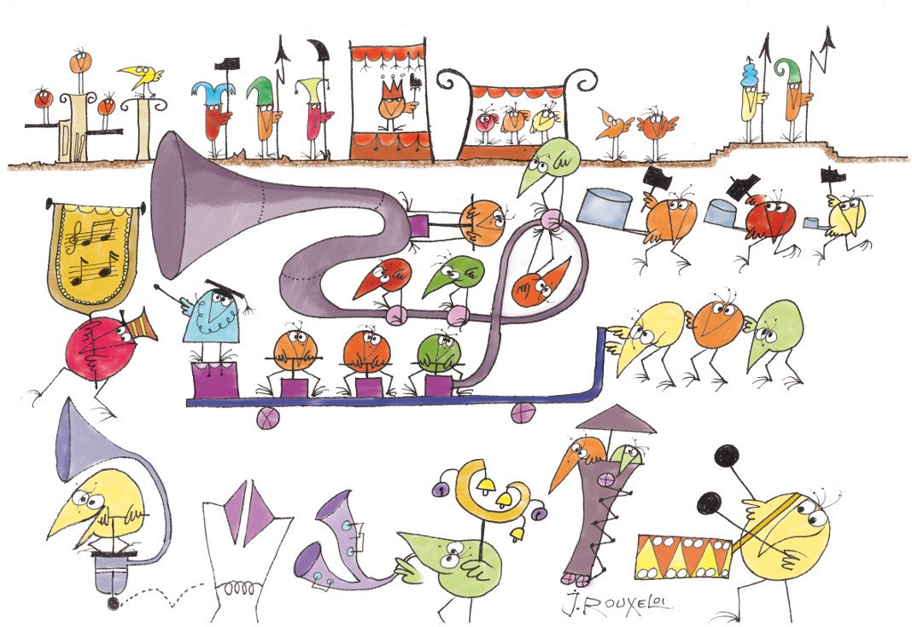
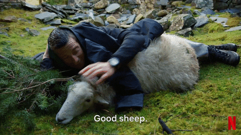
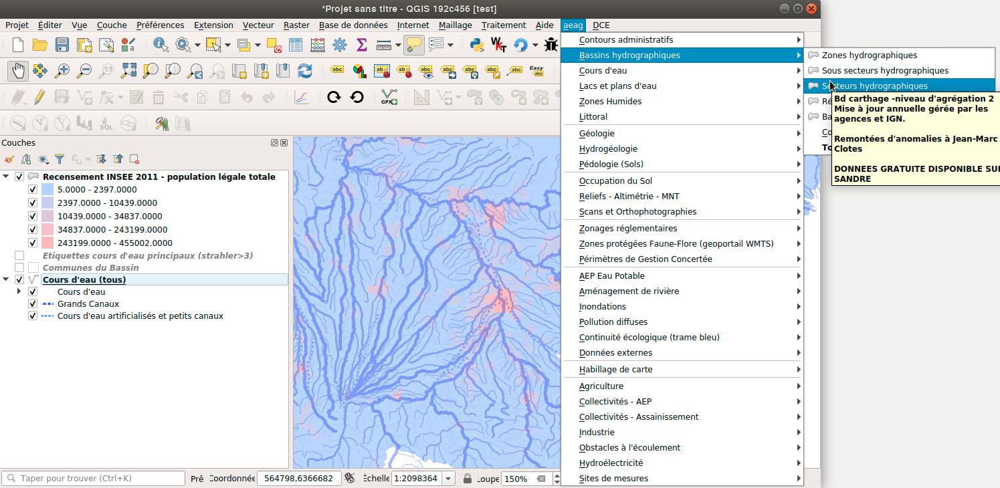

### Du SIG à une base de données de référence décisionnelle, Quelle architecture de base de données ?

*Comment survivre à l'anarchie sur le long terme?*

<!-- .slide: data-background="oslbackground.png" data-background-size="650px" -->

Note:
La fenêtre du speaker peut être ouverte avec la touche 's'
Pour noircir la fenêtre, presser 'b'

---

## /me

```
Régis Haubourg

Géomaticien passionné
ex-administrateur de données géographiques pour une agence de l'eau 
    >>> "SQL saved my life"

Expert géomaticien Open Source chez Oslandia


QGIS & PostGIS fan


Président de l'OSGeo-FR 

                                                                      ...slowly becoming a nerd 

```


---

## OSLANDIA

PME Française crée en 2009

Haute technologie

Open source

Systèmes d’Information Géographique

3D 

DATA/IA


---

## OSLANDIA

15 collaborateurs

**100% télétravail**

**Entreprise horizontale et transparente**

CA 2017 > 1.3 M€ / 30 % croissance / 20 % CA en R&D

100 % indépendant
Projets 20-300K€ ( → 800K€ collab. )

---

## Communautés open Source

QGIS 

PostGIS

iTowns

python, SQL, C++, javascript

stack OSGEO -  mais pas trop le coté JAVA ;-) 

---

## Et vous ?

Qui est arrivé à PostgreSQL par la géomatique et PostGIS?  <!-- .element: class="fragment"  -->

Votre base est-elle?: <!-- .element: class="fragment"  -->
 - applicative ?  <!-- .element: class="fragment"  -->
 - décisionnelle (SIG / datascience / reporting ) ? <!-- .element: class="fragment"  -->
 - un peu des deux? <!-- .element: class="fragment"  -->

---

## C'est quoi un SIG ? 

**Système d'Information Géographique**




---

## C'était quoi un SIG ? 

ArcGIS / Mapinfo / Geoconcept etc..

Un outil bureautique + des formats de stockage (fichier) propriétaires

Un monde séparé de l'informatique traditionnelle

Un métier d'avenir! Mais personne ne comprends ce que c'est.

*toute ressemblance avec le métier de datascientiste est involontaire*

---


version géographe: 

*"Représenter le monde, le comprendre, aider à la décision, .. "*

---


Version commanditaire: 

*"Un truc pour imprimer des cartes"*


---


Version DSI: 

*"Encore un truc avec des serveurs de licences ingérables et qui coûte trop cher"* 

---


version DBA:

*"Une base de donnée avec des types de géométries dedans quoi "*


..
..

et la vie devint plus simple...

---


... enfin presque

---

### Niveaux de maturités de la donnée dans une organisation


Pas d'organisation de l'information numérique. Pas de conscience de l'utilité. Les applications priment sur la donnée  <!-- .element: class="fragment"  -->

---

### Niveaux de maturités de la donnée dans une organisation

Reconnaissance de la valeur intrisèque des données. Collecte, catalogage, Entrepôt garage. "Open Data washing"  <!-- .element: class="fragment"  -->

---

### Niveaux de maturités de la donnée dans une organisation

Les données de référence sont structurées, centralisées, modélisées, harmonisées, et accessibles aux applications. <!-- .element: class="fragment "  -->

Un socle, mais beaucoup de données grises <!-- .element: class="fragment "  -->

---

### Niveaux de maturités de la donnée dans une organisation

Les projets applicatifs sont vus dès le départ sous l'angle de la donnée et sa valeur.  Les données métiers sont standardisée, diffusées  <!-- .element: class="fragment"  -->

Maturité <!-- .element: class="fragment "  -->


---

### Niveaux de maturités de la donnée dans une organisation

La valeur de la donnée est au centre dans le modèle de fonctionnement et génère directement de la valeur.  <!-- .element: class="fragment"  -->

les licornes et GAFAM <!-- .element: class="fragment "  -->

---


# Les Symptômes du chaos


---


## Une base figée par les applications clientes


 

---

## Des schémas avec des noms de services dedans

QGIS drag&drop vers PostGIS...

```sql
SELECT * FROM "serviceRPGD"."_Communes à facturer final1  " ;
```


---

## Des ETLS trop nombreux ?



---

### Des répertoires utilisateurs plus lourds que la base de données 

Agence de l'eau AG, la base de référence:

99% des données = 4 Go

5 tables = 15 Go

Chaque répertoire de fichier de référent SIG = **20Go !**

---

## What could possibly go wrong?  

Ex dans une Métropole. 

2016 : 70 schémas

2019 : 170 schémas


Des schémas avec des noms de services (acronymes)  

Des fondations, c'est mieux si c'est stable.. 


---


# Comment survivre ? 




pour 20 à 50 ans.. 

---

## Wait..

Pourquoi les SIG sont-ils différents d'autres applications? 

- Ils accèdent DIRECTEMENT à la donnée. Pas d'ORM
- Les données ne sont pas spécifiques à une application. 99% de données externes et de référentiels
- 90% des données sont potentiellement géographiques. On veut TOUT. 

---

# Les fondations 


---

## Nommez les choses

``` sql

SELECT
    zovacxov_nconnx,
    trim(zovacxov_r_tyac)::text as zovacxov_r_tyac, --Information [code type de connexion] vers l'Entité [TYPE CONNEXION] par la Relation [TYPE ASSOCIE CONNEXION]
    zovacxov_r_pamo_cmatog ,
    zovacxov_r_porc_cmatog::integer

FROM myenterprisename.zocxov

```

---

### Nommez les choses 

Soyez concis, mais explicite

```
ref.parcelles
ref.insee_recensement
ref.admin_departement
ref.routier_troncon
ref.hydro_cours_eau
ref.hydro_lac
zon.zone_vulnerable

```

---

##  Exploiter les VUES:

  - Interface avec le modèle privé (tables)
  - Remise en forme (le SIG aime les données en colonnes)
  - Doc utilisateur 

```sql
SELECT * from ref.v_admin_communes_recensement_insee2019

```

---

## Garder un modèle non verrouillé

- Les vues sont éditables, 
- faites en des abstractions entre le modèle de données privé et les serviuces externes

---

## Les pièges !


Evitez les vues en cascade (1 à 2 niveaux max) : verrouillage du modèle<!-- .element: class="fragment "  -->

Evitez au maximum les vues matérialisées<!-- .element: class="fragment "  -->

Analyser le plan d'éxecution systèmatiquement / optimiser<!-- .element: class="fragment "  -->

Les vues n'ont pas toutes métadonnées technique (extent, clé primaire). Lenteur potentielle à l'ouverture<!-- .element: class="fragment "  -->


---

## Embrassez le modèle orienté service


 ORM, API : OUI! (mais pas en SIG)<!-- .element: class="fragment "  -->

 Gardez la logique métier dans la base<!-- .element: class="fragment "  -->

 Vues simples<!-- .element: class="fragment "  -->

 Procédures stockées pour remplir les API<!-- .element: class="fragment "  -->

---


## Versionnez !

```bash

pg_dump --exclude-schema=public --schema-only my_precious_schema.sql 
git add my_precious_schema.sql
git add my_previous_etl_loading_script.wtf
git commit -m "my daily parachute"
git push

```

---

## Luttez contre les données grises

Répondez aux besoins des utilisateurs<!-- .element: class="fragment "  -->

Formez au SQL<!-- .element: class="fragment "  -->

Formez au SQL<!-- .element: class="fragment "  -->

Formez au SQL (repeat after me)<!-- .element: class="fragment "  -->

Et aussi, tendre vers des traitements reproductibles partout (script SQL, notebook, job ETL) <!-- .element: class="fragment "  -->

---

## RTFM

Pour les administrateurs de données 

```SQL

COMMENT ON TABLE qwat_od.consumptionzone  IS 'consumption zones. loaded by ETL script 42 ';

```

Pour les utilisateurs

```SQL

COMMENT ON VIEW qwat_od.consumptionzone IS 'consumption zones. Represent some real world thing. RESTRICTED DATA DO NOT CAST OUSTIDE.';
``` 

---

##  RTFCatalog 

Les utilisateurs veulent trouver ça:



---

### Cataloguer

Générez **automatiquement** des catalogues de métadonnées  sur les informations orientées utilisateurs (Ex: Talend Metadata crawler)

  - couches SIG travaillées 
  - indexer des projets  SIG et pas des bases (j'exagère)

Parecequ'on est pas des Shadoks<!-- .element: class="fragment "  -->

---

## Ne mettez pas forcément tout dans la base


---

## Ne mettez pas forcément tout dans la base

GeoPackage will save our souls 


(hihi,c'est une base de données - basée sur SQLite / Spatialite)<!-- .element: class="fragment "  -->

---

## Ne mettez pas forcément tout dans la base

Un schéma PG bac à sable par utilisateur ?

  

---

## Epaisse ma base ? 

Fournir l'intelligence métier au plus près de la donnée ? 

Oui dans le cas d'une base SIG, multiclients


---


# Monitorez

pgbadger, pgclue, powa

- vue sur l'usage réel de la base
- index et contraintes manquantes
- aspects techniques et performances 

---

## Le service SIG, premier fournisseur de référentiels

Charger des référentiels au quotidien. Rechercher la qualité. Diffuser. Utiliser.

Vers un service fournisseur de référentiel à toute l'organisation, au délà du SIG ? 

Mais qui ne vient pas de l'informatique en général...


---


## un travail sans fin


---

## et donc des hommes

Recrutez des administrateurs de données 

Rapprochez administrateurs de données et administrateurs de bases de données 

Restez proche des utilisateurs

Faite comprendre les enjeux de la donnée dans chacun des services

---

# Merci de votre attention 

https://github.com/Oslandia/presentations/tree/master/pgdays_lyon_2019-06-19 


<!-- .slide: data-background="#111" -->

